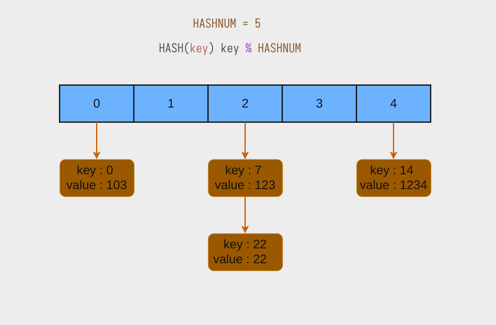
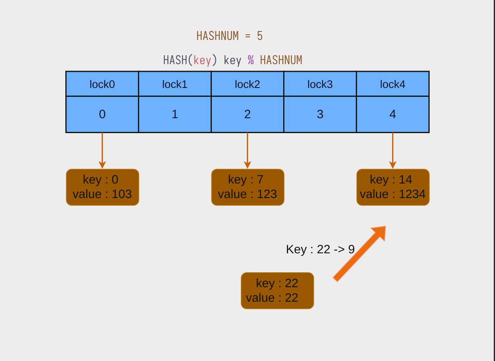

# hash_test

在该任务中，你将处理哈希桶中不同哈希值之间的并发同步任务

## Background

键值对(key - value) : 使用键(key)来索引相应的值(value)。

当键值非常离散时，往往会导致大量的空白资源未被利用。因此采用哈希函数将键映射到一个连续的地址。

在并发环境下，可以通过一把大锁来保证整个哈希桶的并发安全。然而，当某个哈希序列很少被访问时，它仍然需要等待其他序列被访问结束后才能获得锁，这会导致性能损耗。为了优化这种情况，可以采用锁粒度的优化策略，即为每个哈希序列分配一把对应的锁。

## Description

你的任务是协调并发状态下哈希桶中不同哈希序列之间的数据安全

该结构定义为 `hash_lock_t`

在 hash_lock_t 中，HashNode 是哈希节点，各节点之间通过指针来连接([hash_lock.h](../../src/include/hash_lock.h)中定义)。

你需要完成以下四个操作：
- hashInit(hash_lock_t* bucket) : 初始化 hash_lock_t 结构。
- getValue(hash_lock_t* bucket, int key) : 通过 key 值来获取对应的 value。
- insert(hash_lock_t* bucket, int key,int value) : 向哈希桶中添加一个节点，通过 key 来索引对应的哈希序列，如果键已经存在，则覆盖现有值。
- setKey(hash_lock_t* bucket,int key, int new_key) : 重新设置一个节点的key,并将其移动到对应的序列，如果键不存在，则返回-1,成功返回0。

在这个任务中，你可能需要进行堆空间的分配。请放心，无需担心堆空间未释放的问题，因为在本测试中已经包含了相应的节点释放逻辑。

## Declaration

你的实现代码应该在 [hash_lock.c](../../src/lock/hash_lock.c)

具体的测试请参考 README 中的 [Testing](../../README.md)