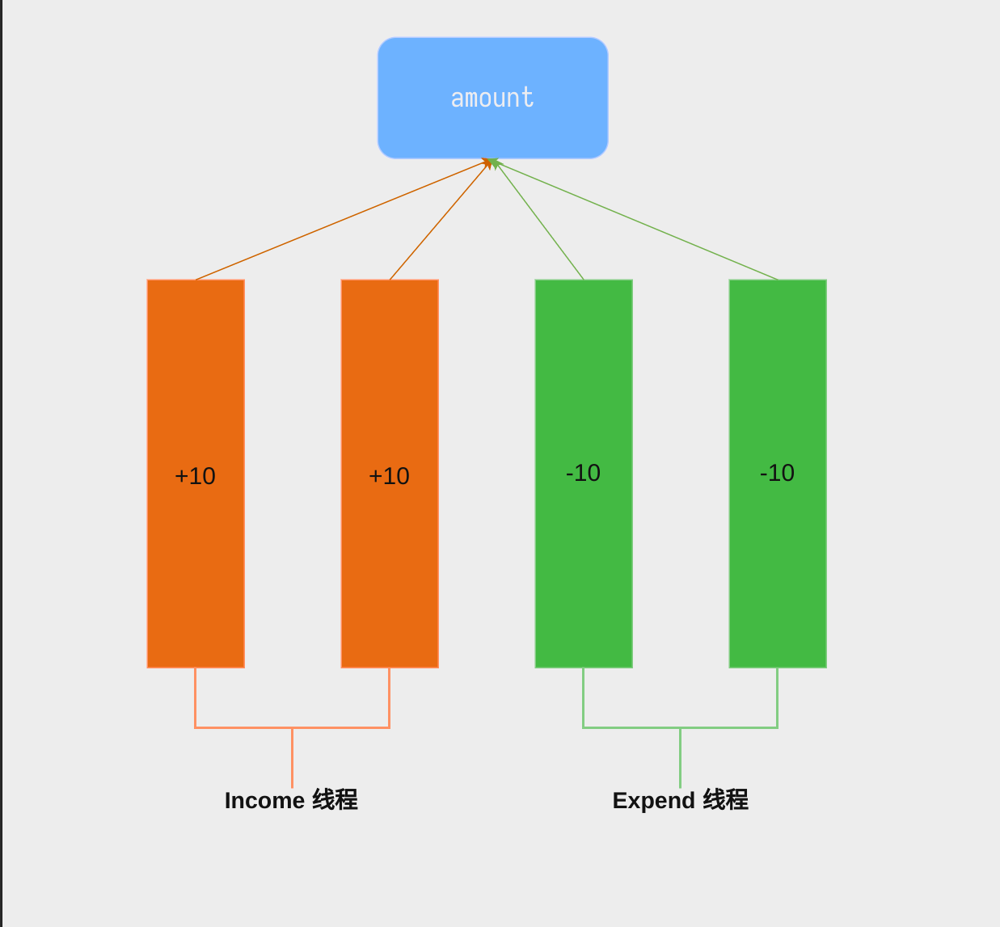

# lock_test

在该任务中，你将处理一个简单的多线程并发同步任务

## Background

在银行账户的资金收入与支出过程中，经常会面临短时间内多笔资金的移动变化。在单线程情况下，面对大量的任务，性能往往无法满足需求。因此，引入多线程成为解决方案。然而，当计算机尚未完成一个请求处理时，又有另一个请求到来，如何保证数据的正确性就显得至关重要。

## Description

account 中的 `amount` 是你需要保证并发安全的数据([lock.h](../../src/include/lock.h)中定义)。

你需要完成以下三个操作：
- amountInit(lock_t* account) : 初始化 account 结构。
- Income(lock_t* account, int amount) : 用于进行资金收入操作，金额为 amount。
- Expend(lock_t* account, int amount) ： 用于进行资金支出操作，金额为 amount。

## Declaration

你的实现代码应该在 [lock.c](../../src/lock/lock.c)

具体的测试请参考 README 中的 [Testing](../../README.md)