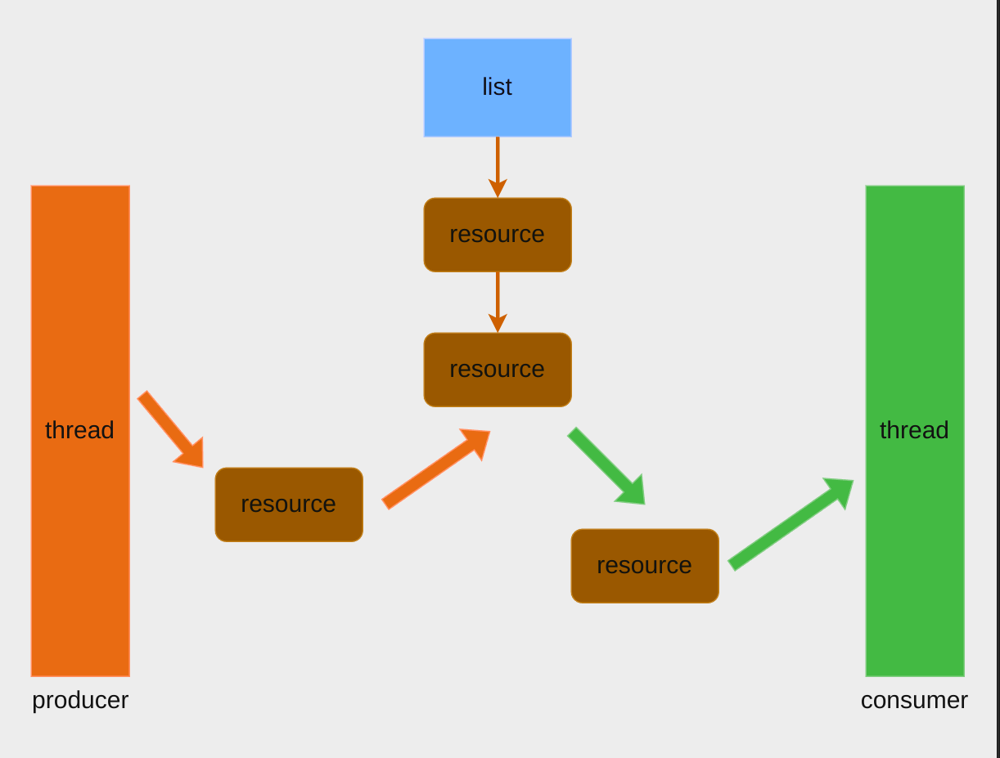
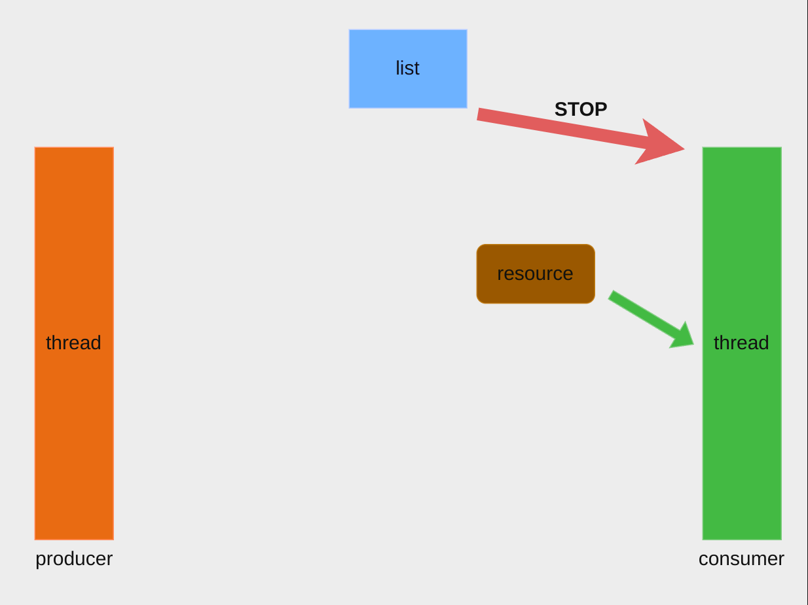

# list_test

在该任务中，你将处理一个生产者消费者问题

## Background

生产者消费者共享缓冲区，生产者向缓冲区中放数据，消费者从缓冲取中取数据

当缓冲取中没有数据时，消费者线程就必须进入挂起休眠状态，直到生产者向缓冲区中放入数据时，消费者才能被唤醒继续从缓冲区中取走数据。

## Description

你的任务是使用互斥锁来维护并发状态下的数据安全，并使用条件变量让消费者线程在适当的时候挂起休眠。

该结构定义为 `list_lock_t`

在 list_lock_t 中，head 代表链表的头部([list_lock.h](../../src/include/list_lock.h)中定义)。

你需要完成以下四个操作：
- listInit(list_lock_t* list) : 初始化 list_lock_t 结构。
- producer(list_lock_t* list, DataType value) : 将生成的数据 value 放入 list 链表中，你可能需要为此分配一个堆区资源。
- consumer(list_lock_t* list) : 从 list 链表中消耗一个数据，并释放其占有的资源。
- getListSize(list_lock_t* list); 获取当前 list 中的资源个数，并返回该个数。

在此任务中，生成的数据并无太大的差异，这意味着你可以选择从头部插入或消耗数据，也可以选择从尾部插入或消耗数据。

## Declaration

你的实现代码应该在 [list_lock.c](../../src/lock/list_lock.c)

具体的测试请参考 README 中的 [Testing](../../README.md)